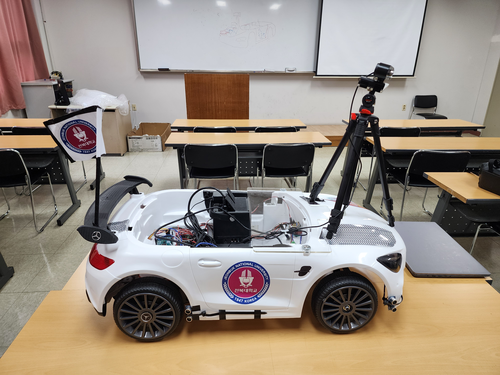

# 2023 자율주행 SW 경진대회 프로젝트 (Team S.W.B)

> 2023년 가천대학교에서 열린 **제2회 자율주행 SW 경진대회** 출전을 위해 제작한 자율주행 차량 및 소프트웨어 코드입니다.

  

본 프로젝트는 카메라, 초음파 센서, 아두이노 기반 하드웨어를 활용하여  
**차선 인식, 고속 주행, 장애물 회피, 자율 주차, 신호 인식** 등 다양한 미션을 수행하는 자율주행 시스템을 구현하였습니다.

---

##  팀 구성 (Team S.W.B)

| 역할     | 이름     | 소속 |
|----------|----------|------|
| 팀장     | 고태환   | 기계시스템공학부 19학번 |
| 부팀장   | 양성식   | 기계공학과 18학번       |
| 팀원     | 오형주   | 기계공학과 18학번       |
| 팀원     | 이우석   | 기계시스템공학부 20학번 |
| 팀원     | 장범준   | 기계시스템공학부 19학번 |
| 팀원     | 김동훈   | 전자공학부 21학번       |

---

##  디렉토리 구조

- `control/` : 아두이노 기반 차량 제어 코드 (속도, 조향, 장애물 회피, 주차 등)
- `detect/` : YOLOv5 기반 차선 인식 모델 및 실시간 감지 코드
- `README.md` : 프로젝트 소개 문서

> 각 디렉토리의 상세한 설명은 해당 폴더에 있는 `README.md`를 참고해주세요.
