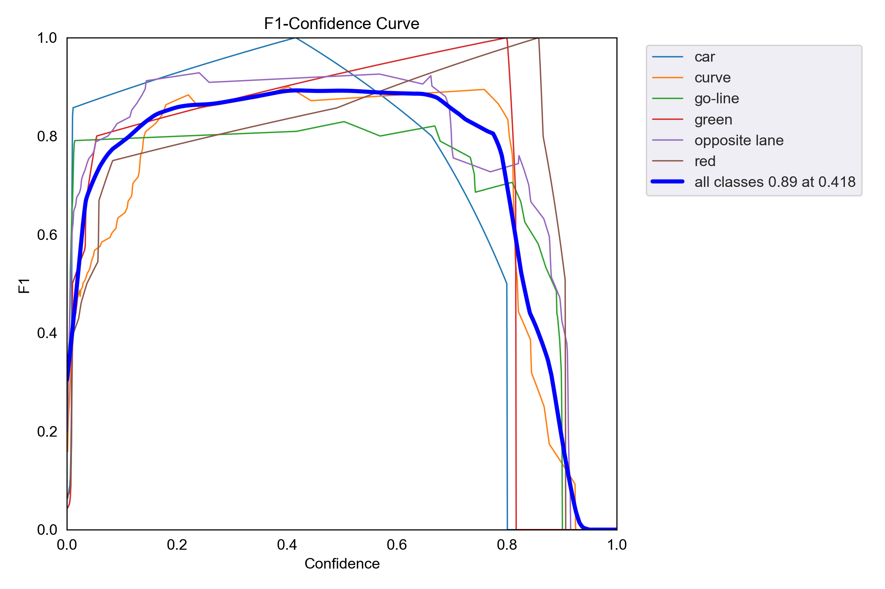
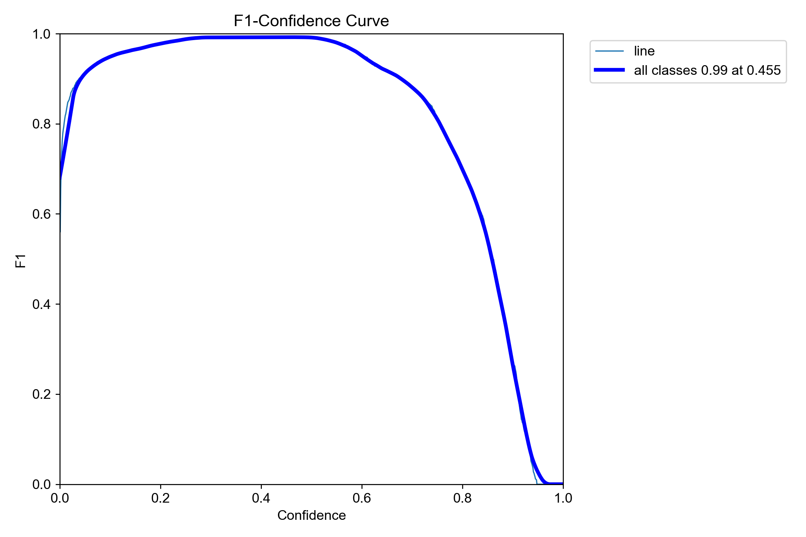
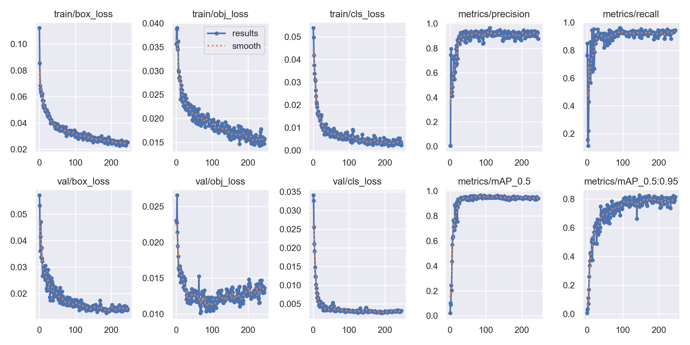
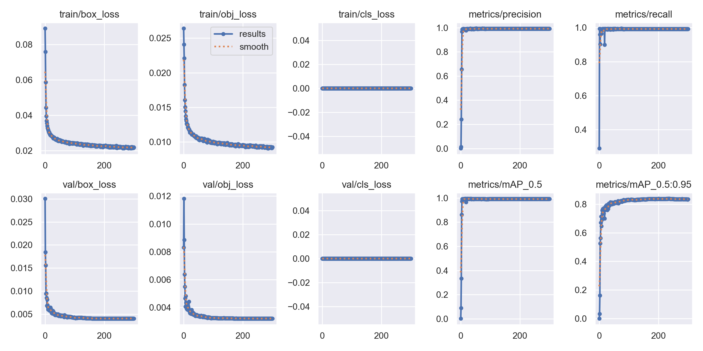

# detect 디렉토리 소개 (YOLOv5 기반 차선 인식)

`detect/` 폴더는 자율주행 차량에서 **차선 인식**을 위한 YOLOv5 기반 객체 감지 모델과 실행 코드를 포함하고 있습니다.  
PyTorch 기반 YOLOv5 모델을 학습한 후, 카메라로 실시간 차선을 감지하고 **중심 좌표를 계산하여 아두이노로 전송**하는 구조입니다.

---

## 구성 파일

| 파일명              | 설명 |
|--------------------|------|
| `detect.py`        | YOLOv5 실시간 감지 및 아두이노로 좌표 전송 |
| `results.png`      | 학습 시 precision, recall, mAP, loss 등 epoch별 변화 그래프 |
| `F1_curve.png`     | 단일 클래스(line) 기준 confidence-F1 곡선 |
| `F1_curve (1).png` | 다중 클래스 기준 confidence-F1 곡선 (성능 하락 모델) |

---

## 성능 비교 (개선 전후)

| 항목              | 개선 전                   | 개선 후  |
|-------------------|------------------------|------------------------|
| `mAP@0.5`         | 약 0.89                | 약 0.95 이상             |
| `mAP@0.5:0.95`    | 약 0.80                | 약 0.85 이상             |
| `F1 score`        | 0.89 @ 0.418          | 0.99 @ 0.455            |
| `train/cls_loss`  | 0.05 이하              | 0                       |


#### 개선 전


#### 개선 후


### 학습 그래프 비교

#### 개선 전


#### 개선 후

---

## 사용법

다음 명령어로 실시간 감지를 실행할 수 있습니다:

```bash
python detect.py --weights ./runs/train/weights/best.pt --conf 0.45 --source 0
